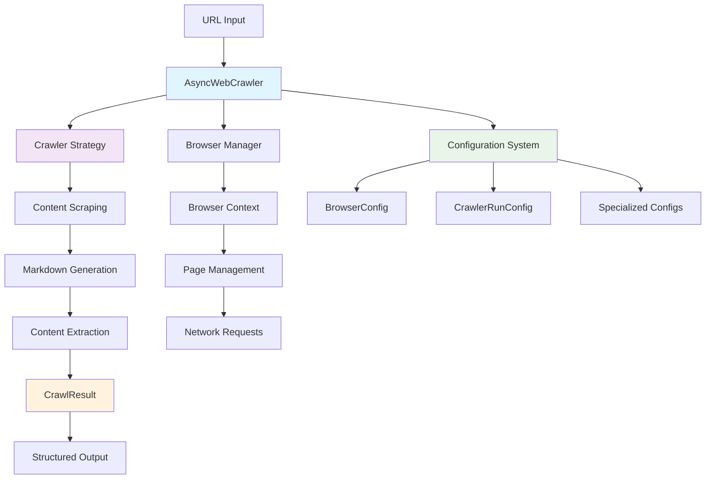
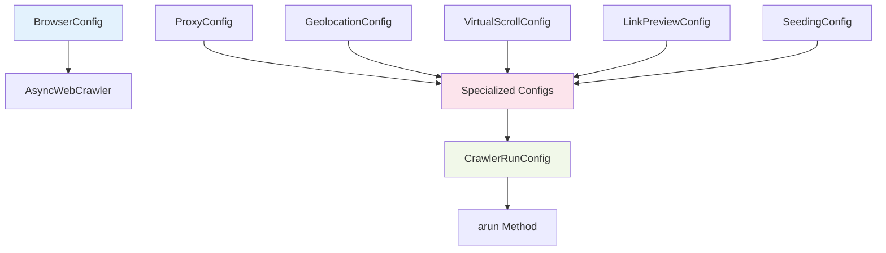
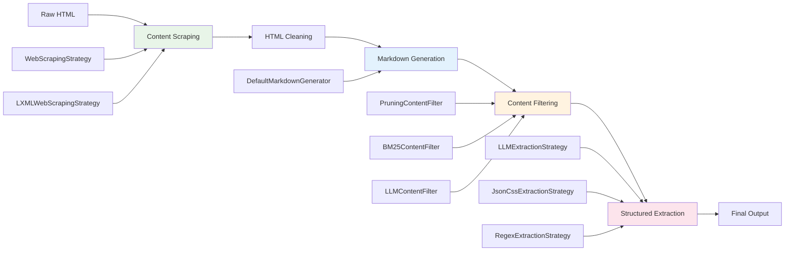
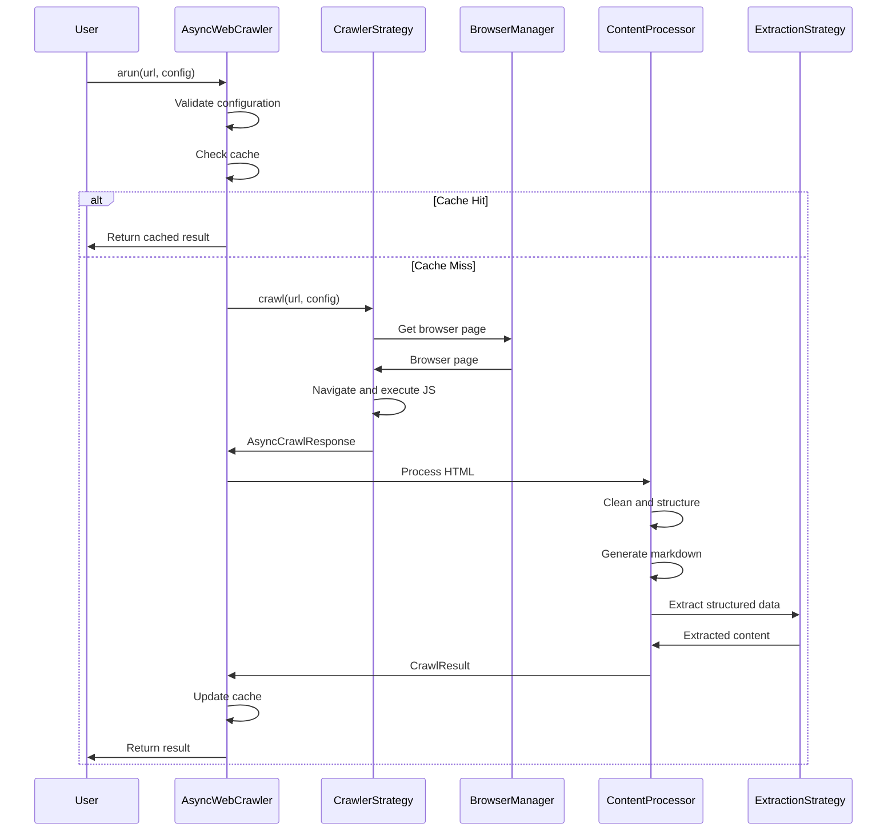

# Crawl4AI: Comprehensive Design and Tutorial Guide

## Table of Contents

1. [Introduction and Overview](#introduction-and-overview)
2. [High-Level Architecture](#high-level-architecture)
3. [Core Components Deep Dive](#core-components-deep-dive)
4. [Component Interactions and Data Flow](#component-interactions-and-data-flow)
5. [Configuration System](#configuration-system)
6. [Common Usage Patterns](#common-usage-patterns)
7. [Advanced Features](#advanced-features)
8. [Deployment and Scaling](#deployment-and-scaling)
9. [Extension Points and Customization](#extension-points-and-customization)
10. [Best Practices and Troubleshooting](#best-practices-and-troubleshooting)

---

## Introduction and Overview

### What is Crawl4AI?

Crawl4AI is a sophisticated, asynchronous web crawling and scraping library designed specifically for AI and LLM applications. It transforms web content into clean, structured data formats that are optimized for machine learning workflows, RAG (Retrieval-Augmented Generation) systems, and AI training pipelines.

### Key Design Principles

1. **LLM-Friendly Output**: Generates clean, structured Markdown optimized for AI consumption
2. **Asynchronous Architecture**: Built from ground up with async/await for high performance
3. **Strategy-Driven Design**: Pluggable strategies for different crawling, extraction, and processing needs
4. **Configuration-Centric**: Extensive configuration system enabling customization without code changes
5. **Production-Ready**: Built-in caching, error handling, rate limiting, and scaling capabilities

### Why Crawl4AI?

- **6x Faster** than traditional crawlers through async processing
- **AI-Optimized** content extraction with heuristic intelligence
- **Flexible Browser Control** with session management and proxy support
- **Open Source** with no API keys required for basic functionality
- **Enterprise Ready** with Docker deployment and cloud integration

---

## High-Level Architecture



### Core Architecture Components

1. **AsyncWebCrawler**: Main orchestrator managing the entire crawling process
2. **Strategy Layer**: Pluggable strategies for different crawling approaches
3. **Configuration System**: Comprehensive configuration management
4. **Content Pipeline**: Multi-stage content processing and extraction
5. **Browser Management**: Advanced browser context and session handling

---

## Core Components Deep Dive

### 1. AsyncWebCrawler - The Heart of the System

The `AsyncWebCrawler` is the main entry point and orchestrates all crawling operations.

#### Lifecycle Management

```python
# Context Manager Pattern (Recommended)
async with AsyncWebCrawler() as crawler:
    result = await crawler.arun(url="https://example.com")
    print(result.markdown)

# Explicit Lifecycle Management (Long-running applications)
crawler = AsyncWebCrawler()
await crawler.start()

# Use crawler multiple times
result1 = await crawler.arun(url="https://example.com")
result2 = await crawler.arun(url="https://another.com")

await crawler.close()
```

#### Key Responsibilities

- **Browser Management**: Controls browser instances and contexts
- **Request Coordination**: Manages concurrent requests and rate limiting
- **Content Processing**: Orchestrates the content processing pipeline
- **Error Handling**: Provides robust error handling and recovery
- **Caching**: Manages intelligent caching for performance

### 2. Configuration System Architecture

The configuration system is built around composition and inheritance, providing maximum flexibility while maintaining simplicity.

#### Configuration Hierarchy



#### BrowserConfig: Browser-Level Settings

Controls browser instance creation and context management:

```python
browser_config = BrowserConfig(
    browser_type="chromium",        # Browser engine
    headless=True,                  # Headless operation
    browser_mode="dedicated",       # Instance management
    use_persistent_context=True,    # Session persistence
    user_data_dir="/path/to/profile", # Profile location
    viewport_width=1920,            # Viewport dimensions
    viewport_height=1080,
    proxy="http://proxy:8080",      # Proxy settings
    user_agent="Custom UA",         # User agent string
    headers={"Accept": "text/html"}, # Default headers
    cookies=[{"name": "session", "value": "123"}] # Cookies
)
```

#### CrawlerRunConfig: Runtime Behavior Control

Controls how individual crawl operations behave:

```python
run_config = CrawlerRunConfig(
    # Content Processing
    word_count_threshold=200,
    extraction_strategy=LLMExtractionStrategy(...),
    chunking_strategy=RegexChunking(),
    markdown_generator=DefaultMarkdownGenerator(),
    
    # Page Interaction
    js_code=["window.scrollTo(0, document.body.scrollHeight);"],
    wait_for="div.content",
    page_timeout=30000,
    
    # Content Filtering
    css_selector="article.main-content",
    excluded_tags=["script", "style"],
    
    # Media Handling
    screenshot=True,
    pdf=True,
    
    # Caching
    cache_mode=CacheMode.ENABLED,
    
    # Advanced Features
    deep_crawl_strategy=BFSDeepCrawlStrategy(...),
    virtual_scroll_config=VirtualScrollConfig(...)
)
```

### 3. Content Processing Pipeline

The content processing pipeline transforms raw HTML into structured, AI-ready data through multiple stages.



#### Stage 1: Content Scraping

Extracts and cleans HTML content:

```python
class WebScrapingStrategy(ContentScrapingStrategy):
    def scrap(self, url: str, html: str, **kwargs) -> ScrapingResult:
        # Remove unwanted elements
        # Extract media, links, and metadata
        # Clean and structure HTML
        return ScrapingResult(
            cleaned_html=cleaned_html,
            media=media_items,
            links=extracted_links,
            metadata=page_metadata
        )
```

#### Stage 2: Markdown Generation

Converts HTML to clean, structured Markdown:

```python
markdown_generator = DefaultMarkdownGenerator(
    content_filter=PruningContentFilter(threshold=0.48),
    # content_filter=BM25ContentFilter(user_query="specific topic")
)

result = markdown_generator.generate_markdown(
    input_html=cleaned_html,
    base_url=url
)
# Returns: MarkdownGenerationResult with raw_markdown, fit_markdown, citations
```

#### Stage 3: Structured Extraction

Extracts structured data using various strategies:

```python
# LLM-based extraction
extraction_strategy = LLMExtractionStrategy(
    llm_config=LLMConfig(provider="openai/gpt-4"),
    schema=ProductSchema.schema(),
    extraction_type="schema",
    instruction="Extract product information including name, price, and description"
)

# CSS-based extraction (no LLM required)
extraction_strategy = JsonCssExtractionStrategy({
    "name": "Product Catalog",
    "baseSelector": ".product-card",
    "fields": [
        {"name": "title", "selector": "h2", "type": "text"},
        {"name": "price", "selector": ".price", "type": "text"},
        {"name": "image", "selector": "img", "type": "attribute", "attribute": "src"}
    ]
})
```

### 4. Advanced Strategy System

Crawl4AI uses the Strategy Pattern extensively, allowing different approaches for various operations.

#### Crawler Strategies

```python
# Playwright-based crawling (default)
playwright_strategy = AsyncPlaywrightCrawlerStrategy(
    browser_config=browser_config,
    logger=logger
)

# HTTP-only crawling (lightweight)
http_strategy = AsyncHTTPCrawlerStrategy(
    http_config=HTTPCrawlerConfig(
        method="GET",
        headers={"User-Agent": "Crawl4AI"},
        follow_redirects=True
    )
)
```

#### Deep Crawling Strategies

```python
# Breadth-First Search
bfs_strategy = BFSDeepCrawlStrategy(
    max_depth=3,
    max_pages=50,
    filter_chain=FilterChain([
        DomainFilter(allowed_domains=["example.com"]),
        URLPatternFilter(patterns=["*/blog/*", "*/news/*"])
    ])
)

# Depth-First Search
dfs_strategy = DFSDeepCrawlStrategy(
    max_depth=5,
    max_pages=20
)

# Best-First (AI-guided)
best_first_strategy = BestFirstCrawlingStrategy(
    scorer=CompositeScorer([
        KeywordRelevanceScorer(keywords=["AI", "machine learning"]),
        DomainAuthorityScorer(),
        FreshnessScorer()
    ])
)
```

---

## Component Interactions and Data Flow

### Request Processing Flow



### Error Handling and Recovery

The system implements comprehensive error handling at multiple levels:

1. **Network Level**: Retry mechanisms with exponential backoff
2. **Browser Level**: Page recovery and context recreation
3. **Content Level**: Fallback strategies for extraction failures
4. **Application Level**: Graceful degradation and error reporting

---

## Configuration System

### Configuration Composition and Inheritance

The configuration system allows fine-grained control over every aspect of crawling behavior.

#### Browser Configuration Examples

```python
# Development Configuration
dev_config = BrowserConfig(
    headless=False,          # Visible browser for debugging
    browser_mode="dedicated", # New instance per session
    verbose=True,            # Detailed logging
    extra_args=["--disable-web-security"]  # Development flags
)

# Production Configuration
prod_config = BrowserConfig(
    headless=True,           # Headless operation
    browser_mode="builtin",  # Use managed browser pool
    user_data_dir="/app/profiles", # Persistent profiles
    proxy_config=ProxyConfig(
        server="http://proxy:8080",
        username="user",
        password="pass"
    )
)

# High-Performance Configuration
perf_config = BrowserConfig(
    browser_mode="docker",   # Containerized browsers
    text_mode=True,         # Disable images/media
    light_mode=True,        # Minimal features
    extra_args=[
        "--no-sandbox",
        "--disable-gpu",
        "--disable-dev-shm-usage"
    ]
)
```

#### Runtime Configuration Examples

```python
# Basic Content Extraction
basic_config = CrawlerRunConfig(
    cache_mode=CacheMode.ENABLED,
    wait_until="domcontentloaded",
    screenshot=False
)

# AI-Optimized Extraction
ai_config = CrawlerRunConfig(
    extraction_strategy=LLMExtractionStrategy(
        llm_config=LLMConfig(provider="openai/gpt-4"),
        schema=MySchema.schema(),
        instruction="Extract key information for AI training"
    ),
    markdown_generator=DefaultMarkdownGenerator(
        content_filter=BM25ContentFilter(
            user_query="technical documentation",
            bm25_threshold=1.0
        )
    ),
    word_count_threshold=500,
    image_score_threshold=8
)

# Dynamic Content Handling
dynamic_config = CrawlerRunConfig(
    js_code=[
        "window.scrollTo(0, document.body.scrollHeight);",
        "await new Promise(r => setTimeout(r, 2000));"
    ],
    wait_for=".dynamic-content",
    scan_full_page=True,
    virtual_scroll_config=VirtualScrollConfig(
        container_selector="[data-testid='feed']",
        scroll_count=20,
        wait_after_scroll=1.0
    )
)
```

### Specialized Configurations

#### Geolocation-Aware Crawling

```python
geo_config = CrawlerRunConfig(
    locale="en-US",
    timezone_id="America/New_York",
    geolocation=GeolocationConfig(
        latitude=40.7128,
        longitude=-74.0060,
        accuracy=10.0
    )
)
```

#### Advanced Proxy Management

```python
proxy_rotation = RoundRobinProxyStrategy([
    ProxyConfig(server="http://proxy1:8080", username="user1", password="pass1"),
    ProxyConfig(server="http://proxy2:8080", username="user2", password="pass2"),
    ProxyConfig(server="http://proxy3:8080", username="user3", password="pass3")
])

config = CrawlerRunConfig(
    proxy_rotation_strategy=proxy_rotation
)
```

---

## Common Usage Patterns

### Pattern 1: Basic Web Scraping

```python
import asyncio
from crawl4ai import AsyncWebCrawler, BrowserConfig, CrawlerRunConfig

async def basic_scraping():
    browser_config = BrowserConfig(headless=True, verbose=True)
    
    async with AsyncWebCrawler(config=browser_config) as crawler:
        run_config = CrawlerRunConfig(
            word_count_threshold=200,
            screenshot=True
        )
        
        result = await crawler.arun(
            url="https://example.com/news",
            config=run_config
        )
        
        print(f"Title: {result.metadata.get('title')}")
        print(f"Content length: {len(result.markdown)}")
        print(f"Images found: {len(result.media['images'])}")
        
        if result.screenshot:
            with open("screenshot.png", "wb") as f:
                f.write(result.screenshot)

asyncio.run(basic_scraping())
```

### Pattern 2: Structured Data Extraction

```python
import json
from pydantic import BaseModel, Field
from crawl4ai import LLMExtractionStrategy, LLMConfig

class ProductInfo(BaseModel):
    name: str = Field(description="Product name")
    price: str = Field(description="Product price")
    description: str = Field(description="Product description")
    availability: bool = Field(description="Whether product is in stock")

async def structured_extraction():
    extraction_strategy = LLMExtractionStrategy(
        llm_config=LLMConfig(
            provider="openai/gpt-4",
            api_token=os.getenv("OPENAI_API_KEY")
        ),
        schema=ProductInfo.schema(),
        extraction_type="schema",
        instruction="Extract product information from the webpage"
    )
    
    run_config = CrawlerRunConfig(
        extraction_strategy=extraction_strategy,
        word_count_threshold=100
    )
    
    async with AsyncWebCrawler() as crawler:
        result = await crawler.arun(
            url="https://shop.example.com/product/123",
            config=run_config
        )
        
        products = json.loads(result.extracted_content)
        for product in products:
            print(f"Product: {product['name']}")
            print(f"Price: {product['price']}")
            print(f"Available: {product['availability']}")
```

### Pattern 3: Mass Crawling with Rate Limiting

```python
from crawl4ai import MemoryAdaptiveDispatcher, RateLimiter

async def mass_crawling():
    urls = [
        "https://example.com/page1",
        "https://example.com/page2",
        # ... hundreds of URLs
    ]
    
    # Configure dispatcher for optimal performance
    dispatcher = MemoryAdaptiveDispatcher(
        rate_limiter=RateLimiter(
            base_delay=(0.5, 1.0),  # Random delay between requests
            max_delay=10.0,         # Maximum backoff delay
            max_retries=3           # Retry failed requests
        )
    )
    
    run_config = CrawlerRunConfig(
        cache_mode=CacheMode.ENABLED,
        semaphore_count=10,     # Concurrent connections
        mean_delay=0.1,         # Base delay between requests
        max_range=0.3           # Random additional delay
    )
    
    async with AsyncWebCrawler() as crawler:
        results = await crawler.arun_many(
            urls=urls,
            config=run_config,
            dispatcher=dispatcher
        )
        
        successful = [r for r in results if r.success]
        print(f"Successfully crawled {len(successful)}/{len(urls)} pages")
```

### Pattern 4: Session Management and Authentication

```python
async def authenticated_crawling():
    # Create persistent browser context
    browser_config = BrowserConfig(
        use_persistent_context=True,
        user_data_dir="./browser_profiles/session1",
        cookies=[
            {
                "name": "session_token",
                "value": "abc123",
                "url": "https://protected-site.com"
            }
        ],
        headers={
            "Authorization": "Bearer your-token-here"
        }
    )
    
    run_config = CrawlerRunConfig(
        session_id="authenticated_session",  # Reuse session
        wait_for=".user-dashboard",         # Wait for authenticated content
        js_code=[
            # Perform login if needed
            """
            if (document.querySelector('#login-form')) {
                document.querySelector('#username').value = 'your-username';
                document.querySelector('#password').value = 'your-password';
                document.querySelector('#login-button').click();
                await new Promise(r => setTimeout(r, 2000));
            }
            """
        ]
    )
    
    async with AsyncWebCrawler(config=browser_config) as crawler:
        # First request establishes session
        result1 = await crawler.arun(
            url="https://protected-site.com/login",
            config=run_config
        )
        
        # Subsequent requests reuse session
        result2 = await crawler.arun(
            url="https://protected-site.com/dashboard",
            config=run_config.clone(js_code=None)  # No login needed
        )
```

---

## Advanced Features

### 1. Adaptive Crawling

Adaptive crawling uses machine learning techniques to understand website patterns and improve extraction over time.

```python
from crawl4ai import AdaptiveCrawler, AdaptiveConfig, StatisticalStrategy

async def adaptive_crawling():
    adaptive_config = AdaptiveConfig(
        confidence_threshold=0.7,  # Stop when confident enough
        max_depth=5,              # Maximum crawl depth
        max_pages=20,             # Maximum pages to analyze
        strategy="statistical"    # Use statistical learning
    )
    
    async with AsyncWebCrawler() as crawler:
        adaptive_crawler = AdaptiveCrawler(crawler, adaptive_config)
        
        # Crawler learns patterns as it processes pages
        crawl_state = await adaptive_crawler.digest(
            start_url="https://news-site.com",
            query="latest technology news"
        )
        
        print(f"Confidence: {crawl_state.confidence}")
        print(f"Pages processed: {crawl_state.pages_processed}")
        print(f"Patterns learned: {len(crawl_state.patterns)}")
```

### 2. Virtual Scroll Handling

Handle infinite scroll pages like social media feeds:

```python
async def virtual_scroll_crawling():
    scroll_config = VirtualScrollConfig(
        container_selector="[data-testid='tweet-list']",
        scroll_count=50,                    # Number of scroll actions
        scroll_by="container_height",       # Scroll by container height
        wait_after_scroll=1.0               # Wait for content to load
    )
    
    run_config = CrawlerRunConfig(
        virtual_scroll_config=scroll_config,
        wait_for="[data-testid='tweet']",   # Wait for tweets to load
        page_timeout=60000                   # Extended timeout
    )
    
    async with AsyncWebCrawler() as crawler:
        result = await crawler.arun(
            url="https://twitter.com/trending",
            config=run_config
        )
        
        # Extract tweets from the scrolled content
        tweets = re.findall(r'data-testid="tweet"[^>]*>(.*?)</div>', result.html)
        print(f"Extracted {len(tweets)} tweets")
```

### 3. Intelligent Link Analysis

Analyze and score links for relevance:

```python
async def intelligent_link_analysis():
    link_config = LinkPreviewConfig(
        include_internal=True,
        include_external=False,
        query="machine learning tutorials",  # BM25 scoring query
        score_threshold=0.3,                # Minimum relevance score
        concurrency=20,                     # Concurrent link processing
        max_links=100                       # Limit number of links
    )
    
    run_config = CrawlerRunConfig(
        link_preview_config=link_config,
        score_links=True                    # Enable intrinsic scoring
    )
    
    async with AsyncWebCrawler() as crawler:
        result = await crawler.arun(
            url="https://educational-site.com",
            config=run_config
        )
        
        # Analyze scored links
        internal_links = result.links['internal']
        for link in internal_links:
            if link.total_score and link.total_score > 0.5:
                print(f"High-value link: {link.href}")
                print(f"  Text: {link.text}")
                print(f"  Score: {link.total_score}")
                if link.head_data:
                    print(f"  Title: {link.head_data.get('title')}")
```

### 4. URL Discovery and Seeding

Discover relevant URLs from sitemaps and Common Crawl:

```python
async def url_discovery():
    seeding_config = SeedingConfig(
        source="sitemap+cc",        # Use both sitemaps and Common Crawl
        pattern="*/blog/*",         # Focus on blog posts
        live_check=True,           # Verify URLs are accessible
        extract_head=True,         # Extract metadata
        query="python tutorials",  # Relevance scoring
        score_threshold=0.4,       # Minimum relevance
        max_urls=500               # Limit discovered URLs
    )
    
    async with AsyncWebCrawler() as crawler:
        # Discover URLs
        discovered_urls = await crawler.aseed_urls(
            domain_or_domains="realpython.com",
            config=seeding_config
        )
        
        print(f"Discovered {len(discovered_urls)} relevant URLs")
        
        # Crawl discovered URLs
        run_config = CrawlerRunConfig(
            extraction_strategy=LLMExtractionStrategy(...),
            cache_mode=CacheMode.ENABLED
        )
        
        results = await crawler.arun_many(
            urls=discovered_urls[:50],  # Process top 50 URLs
            config=run_config
        )
```

### 5. Deep Crawling Strategies

Systematically explore websites using different traversal strategies:

```python
async def deep_crawling():
    # Define content filters
    filter_chain = FilterChain([
        DomainFilter(allowed_domains=["docs.python.org"]),
        URLPatternFilter(patterns=["*/tutorial/*", "*/howto/*"]),
        ContentTypeFilter(allowed_types=["text/html"]),
        SEOFilter(min_word_count=200)
    ])
    
    # Create BFS strategy
    deep_strategy = BFSDeepCrawlStrategy(
        max_depth=4,
        max_pages=100,
        filter_chain=filter_chain,
        delay_between_requests=1.0
    )
    
    run_config = CrawlerRunConfig(
        deep_crawl_strategy=deep_strategy,
        extraction_strategy=LLMExtractionStrategy(...),
        cache_mode=CacheMode.ENABLED
    )
    
    async with AsyncWebCrawler() as crawler:
        results = await crawler.arun(
            url="https://docs.python.org/3/tutorial/",
            config=run_config
        )
        
        # Results contain all pages discovered during deep crawl
        for result in results:
            print(f"Page: {result.url}")
            print(f"Depth: {result.metadata.get('depth', 0)}")
            print(f"Content length: {len(result.markdown)}")
```

---

## Deployment and Scaling

### Docker Deployment

Crawl4AI provides optimized Docker images for production deployment:

```dockerfile
# Use official Crawl4AI image
FROM unclecode/crawl4ai:0.7.0

# Configure environment
ENV CRAWL4AI_BASE_DIRECTORY=/app/data
ENV HEADLESS=true
ENV BROWSER_MODE=builtin

# Expose API port
EXPOSE 11235

# Start the server
CMD ["python", "-m", "crawl4ai.server"]
```

### Kubernetes Deployment

```yaml
apiVersion: apps/v1
kind: Deployment
metadata:
  name: crawl4ai-deployment
spec:
  replicas: 3
  selector:
    matchLabels:
      app: crawl4ai
  template:
    metadata:
      labels:
        app: crawl4ai
    spec:
      containers:
      - name: crawl4ai
        image: unclecode/crawl4ai:0.7.0
        ports:
        - containerPort: 11235
        env:
        - name: CRAWL4AI_BASE_DIRECTORY
          value: "/app/data"
        - name: HEADLESS
          value: "true"
        resources:
          limits:
            memory: "2Gi"
            cpu: "1000m"
          requests:
            memory: "1Gi"
            cpu: "500m"
        volumeMounts:
        - name: data-volume
          mountPath: /app/data
      volumes:
      - name: data-volume
        persistentVolumeClaim:
          claimName: crawl4ai-pvc
```

### Scaling Considerations

#### Horizontal Scaling

1. **Stateless Design**: Each crawler instance is independent
2. **Shared Cache**: Use Redis or database for shared caching
3. **Load Balancing**: Distribute requests across instances
4. **Browser Pool Management**: Coordinate browser instances

```python
# Production scaling configuration
production_config = BrowserConfig(
    browser_mode="builtin",      # Use managed browser pool
    headless=True,              # Headless for performance
    user_data_dir="/shared/profiles", # Shared profile storage
    extra_args=[
        "--no-sandbox",
        "--disable-dev-shm-usage",
        "--memory-pressure-off"
    ]
)

# Memory-adaptive dispatcher
dispatcher = MemoryAdaptiveDispatcher(
    max_workers=50,             # Adjust based on system resources
    memory_threshold=0.8,       # Scale down if memory usage exceeds 80%
    rate_limiter=RateLimiter(
        base_delay=(0.1, 0.5),
        max_delay=30.0,
        max_retries=3
    )
)
```

#### Performance Optimization

```python
# High-performance configuration
perf_config = CrawlerRunConfig(
    # Minimize content processing
    word_count_threshold=50,
    image_score_threshold=10,      # Skip low-quality images
    exclude_external_images=True,  # Skip external images
    
    # Optimize browser behavior
    wait_until="domcontentloaded", # Don't wait for full load
    page_timeout=15000,            # Shorter timeouts
    screenshot=False,              # Skip screenshots
    pdf=False,                     # Skip PDF generation
    
    # Use efficient extraction
    extraction_strategy=JsonCssExtractionStrategy({
        "title": {"selector": "h1", "type": "text"},
        "content": {"selector": "main", "type": "text"}
    }),
    
    # Aggressive caching
    cache_mode=CacheMode.ENABLED
)
```

---

## Extension Points and Customization

### Creating Custom Extraction Strategies

```python
from crawl4ai.extraction_strategy import ExtractionStrategy
import json
import re

class CustomExtractionStrategy(ExtractionStrategy):
    def __init__(self, custom_patterns: dict, **kwargs):
        super().__init__(**kwargs)
        self.custom_patterns = custom_patterns
    
    def run(self, url: str, sections: list) -> list:
        """Extract data using custom patterns"""
        extracted_data = []
        
        for section in sections:
            data = {}
            for field_name, pattern in self.custom_patterns.items():
                matches = re.findall(pattern, section, re.IGNORECASE)
                if matches:
                    data[field_name] = matches[0] if len(matches) == 1 else matches
            
            if data:  # Only add non-empty results
                extracted_data.append(data)
        
        return extracted_data

# Usage
custom_strategy = CustomExtractionStrategy(
    custom_patterns={
        "email": r'\b[A-Za-z0-9._%+-]+@[A-Za-z0-9.-]+\.[A-Z|a-z]{2,}\b',
        "phone": r'\b\d{3}-\d{3}-\d{4}\b',
        "price": r'\$\d+(?:\.\d{2})?'
    }
)
```

### Creating Custom Content Filters

```python
from crawl4ai.content_filter_strategy import RelevantContentFilter

class CustomContentFilter(RelevantContentFilter):
    def __init__(self, keywords: list, min_score: float = 0.5):
        self.keywords = [k.lower() for k in keywords]
        self.min_score = min_score
    
    def filter_content(self, markdown_content: str) -> str:
        """Filter content based on keyword relevance"""
        lines = markdown_content.split('\n')
        relevant_lines = []
        
        for line in lines:
            score = self._calculate_relevance_score(line)
            if score >= self.min_score:
                relevant_lines.append(line)
        
        return '\n'.join(relevant_lines)
    
    def _calculate_relevance_score(self, text: str) -> float:
        """Calculate relevance score based on keyword presence"""
        text_lower = text.lower()
        keyword_count = sum(1 for keyword in self.keywords if keyword in text_lower)
        return keyword_count / len(self.keywords) if self.keywords else 0.0

# Usage
content_filter = CustomContentFilter(
    keywords=["AI", "machine learning", "neural network", "deep learning"],
    min_score=0.3
)

markdown_generator = DefaultMarkdownGenerator(content_filter=content_filter)
```

### Creating Custom Crawling Strategies

```python
from crawl4ai.async_crawler_strategy import AsyncCrawlerStrategy
from crawl4ai.models import AsyncCrawlResponse

class CustomCrawlerStrategy(AsyncCrawlerStrategy):
    def __init__(self, custom_headers: dict = None, **kwargs):
        super().__init__(**kwargs)
        self.custom_headers = custom_headers or {}
    
    async def crawl(self, url: str, config: CrawlerRunConfig) -> AsyncCrawlResponse:
        """Custom crawling implementation with special headers"""
        
        # Add custom headers
        headers = {**self.custom_headers, **config.headers}
        
        # Custom logic for specific domains
        if "api.example.com" in url:
            headers["API-Version"] = "v2"
            headers["Accept"] = "application/json"
        
        # Create modified config with custom headers
        modified_config = config.clone(headers=headers)
        
        # Delegate to parent implementation
        return await super().crawl(url, modified_config)
    
    async def __aenter__(self):
        """Custom initialization"""
        await super().__aenter__()
        self.logger.info("Custom crawler strategy initialized")
        return self
    
    async def __aexit__(self, exc_type, exc_val, exc_tb):
        """Custom cleanup"""
        self.logger.info("Custom crawler strategy cleaned up")
        await super().__aexit__(exc_type, exc_val, exc_tb)

# Usage
custom_strategy = CustomCrawlerStrategy(
    custom_headers={
        "X-Custom-Client": "Crawl4AI-Custom",
        "X-Request-ID": "unique-request-id"
    }
)

crawler = AsyncWebCrawler(crawler_strategy=custom_strategy)
```

### Hook System Integration

Crawl4AI provides a hook system for customizing behavior at different stages:

```python
class CustomHooks:
    def __init__(self):
        self.request_count = 0
    
    async def before_crawl(self, url: str, config: CrawlerRunConfig) -> CrawlerRunConfig:
        """Hook called before each crawl"""
        self.request_count += 1
        print(f"Starting crawl #{self.request_count} for: {url}")
        
        # Modify config based on URL
        if "slow-site.com" in url:
            return config.clone(page_timeout=60000)  # Extended timeout
        
        return config
    
    async def after_crawl(self, result: CrawlResult) -> CrawlResult:
        """Hook called after each crawl"""
        print(f"Completed crawl for: {result.url}")
        print(f"Success: {result.success}")
        
        # Add custom metadata
        if not result.metadata:
            result.metadata = {}
        result.metadata['crawl_number'] = self.request_count
        result.metadata['processed_at'] = datetime.now().isoformat()
        
        return result
    
    async def on_error(self, url: str, error: Exception) -> bool:
        """Hook called when crawl fails"""
        print(f"Error crawling {url}: {error}")
        
        # Return True to continue with other URLs, False to stop
        return True

# Usage with hooks
async def crawl_with_hooks():
    hooks = CustomHooks()
    
    # Configure crawler with hooks
    run_config = CrawlerRunConfig(
        hooks={
            'before_crawl': hooks.before_crawl,
            'after_crawl': hooks.after_crawl,
            'on_error': hooks.on_error
        }
    )
    
    async with AsyncWebCrawler() as crawler:
        results = await crawler.arun_many([
            "https://example.com/page1",
            "https://slow-site.com/page2",
            "https://example.com/page3"
        ], config=run_config)
```

---

## Best Practices and Troubleshooting

### Performance Optimization Best Practices

#### 1. Efficient Configuration Management

```python
# ✅ Good: Create reusable configurations
base_browser_config = BrowserConfig(
    headless=True,
    browser_mode="builtin",  # Reuse browser instances
    user_data_dir="/tmp/crawl4ai_profiles"
)

fast_run_config = CrawlerRunConfig(
    word_count_threshold=100,      # Lower threshold for speed
    cache_mode=CacheMode.ENABLED,  # Use caching
    screenshot=False,              # Skip screenshots unless needed
    pdf=False,                     # Skip PDF generation
    wait_until="domcontentloaded", # Don't wait for full page load
    page_timeout=15000             # Reasonable timeout
)

# ❌ Bad: Creating new configs every time
async with AsyncWebCrawler() as crawler:
    for url in urls:
        # Don't do this - creates new config objects repeatedly
        result = await crawler.arun(
            url=url,
            config=CrawlerRunConfig(screenshot=True, pdf=True, ...)
        )
```

#### 2. Smart Caching Strategy

```python
# Use cache hierarchy for different content types
async def smart_caching():
    # Static content - cache aggressively
    static_config = CrawlerRunConfig(
        cache_mode=CacheMode.ENABLED,
        # Cache for 7 days for static content
    )
    
    # Dynamic content - cache briefly
    dynamic_config = CrawlerRunConfig(
        cache_mode=CacheMode.ENABLED,
        # Cache for 1 hour for dynamic content
    )
    
    # Real-time content - bypass cache
    realtime_config = CrawlerRunConfig(
        cache_mode=CacheMode.BYPASS
    )
    
    async with AsyncWebCrawler() as crawler:
        # Choose config based on URL pattern
        if "/static/" in url or "/docs/" in url:
            config = static_config
        elif "/api/" in url or "/live/" in url:
            config = realtime_config
        else:
            config = dynamic_config
            
        result = await crawler.arun(url=url, config=config)
```

#### 3. Memory Management

```python
# Configure memory-aware processing
memory_config = CrawlerRunConfig(
    # Limit content processing
    word_count_threshold=1000,     # Skip very long pages
    image_score_threshold=7,       # Skip low-quality images
    exclude_external_images=True,  # Reduce memory usage
    
    # Optimize extraction
    extraction_strategy=JsonCssExtractionStrategy({
        # Use simple CSS selectors instead of LLM
        "title": {"selector": "h1", "type": "text"},
        "content": {"selector": "main", "type": "text"}
    }),
    
    # Control concurrent operations
    semaphore_count=5              # Limit concurrent requests
)

# Use memory-adaptive dispatcher
dispatcher = MemoryAdaptiveDispatcher(
    memory_threshold=0.8,          # Scale down at 80% memory usage
    max_workers=20,                # Limit worker threads
    check_interval=5               # Check memory every 5 seconds
)
```

### Common Issues and Solutions

#### Issue 1: Browser Launch Failures

**Problem**: Browser fails to start or crashes frequently

**Solutions**:
```python
# Solution 1: Add browser stability flags
browser_config = BrowserConfig(
    extra_args=[
        "--no-sandbox",
        "--disable-dev-shm-usage",
        "--disable-gpu",
        "--disable-software-rasterizer",
        "--disable-background-timer-throttling",
        "--disable-renderer-backgrounding",
        "--disable-backgrounding-occluded-windows"
    ]
)

# Solution 2: Use browser mode with better resource management
browser_config = BrowserConfig(
    browser_mode="builtin",        # Use managed browser pool
    headless=True,                 # Reduce resource usage
    viewport_width=1280,           # Smaller viewport
    viewport_height=720
)

# Solution 3: Check system resources
import psutil

def check_system_resources():
    memory = psutil.virtual_memory()
    cpu = psutil.cpu_percent(interval=1)
    
    print(f"Memory usage: {memory.percent}%")
    print(f"CPU usage: {cpu}%")
    
    if memory.percent > 80:
        print("⚠️  High memory usage detected")
    if cpu > 80:
        print("⚠️  High CPU usage detected")
```

#### Issue 2: Content Extraction Problems

**Problem**: Missing or incomplete content extraction

**Solutions**:
```python
# Solution 1: Wait for dynamic content
run_config = CrawlerRunConfig(
    wait_for="div.main-content",           # Wait for specific element
    wait_for_timeout=30000,                # Extended wait time
    js_code=[
        # Trigger content loading
        "window.scrollTo(0, document.body.scrollHeight);",
        "await new Promise(r => setTimeout(r, 2000));"
    ],
    scan_full_page=True,                   # Scroll entire page
    delay_before_return_html=1.0           # Wait before extraction
)

# Solution 2: Use multiple extraction strategies
from crawl4ai import CosineStrategy

fallback_strategies = [
    # Primary: LLM extraction
    LLMExtractionStrategy(
        llm_config=LLMConfig(provider="openai/gpt-4"),
        schema=MySchema.schema()
    ),
    # Fallback 1: CSS extraction
    JsonCssExtractionStrategy({
        "title": {"selector": "h1,h2", "type": "text"},
        "content": {"selector": "article,main,.content", "type": "text"}
    }),
    # Fallback 2: Cosine similarity
    CosineStrategy(
        word_count_threshold=200,
        max_dist=0.2,
        linkage_method='ward',
        top_k=3
    )
]

async def extract_with_fallback(url: str):
    async with AsyncWebCrawler() as crawler:
        for i, strategy in enumerate(fallback_strategies):
            try:
                config = CrawlerRunConfig(extraction_strategy=strategy)
                result = await crawler.arun(url=url, config=config)
                
                if result.extracted_content:
                    print(f"Success with strategy {i+1}")
                    return result
            except Exception as e:
                print(f"Strategy {i+1} failed: {e}")
                continue
        
        print("All extraction strategies failed")
        return None
```

#### Issue 3: Rate Limiting and Blocking

**Problem**: Getting blocked or rate limited by websites

**Solutions**:
```python
# Solution 1: Implement proper rate limiting
rate_limiter = RateLimiter(
    base_delay=(1.0, 3.0),        # Random delay between 1-3 seconds
    max_delay=60.0,               # Maximum backoff
    max_retries=3,                # Retry failed requests
    respect_retry_after=True      # Respect server retry-after headers
)

dispatcher = MemoryAdaptiveDispatcher(rate_limiter=rate_limiter)

# Solution 2: Use proxy rotation
proxy_configs = [
    ProxyConfig.from_string("proxy1:8080:user1:pass1"),
    ProxyConfig.from_string("proxy2:8080:user2:pass2"),
    ProxyConfig.from_string("proxy3:8080:user3:pass3")
]

proxy_strategy = RoundRobinProxyStrategy(proxy_configs)

run_config = CrawlerRunConfig(
    proxy_rotation_strategy=proxy_strategy,
    user_agent_mode="random",      # Randomize user agents
    simulate_user=True,            # Add human-like behavior
    mean_delay=2.0,                # Base delay between requests
    max_range=1.0                  # Additional random delay
)

# Solution 3: Respect robots.txt
run_config = CrawlerRunConfig(
    check_robots_txt=True,         # Check robots.txt before crawling
    user_agent="YourBot/1.0 (+https://yoursite.com/bot-info)"
)
```

### Debugging Techniques

#### 1. Enable Verbose Logging

```python
import logging

# Configure detailed logging
logging.basicConfig(
    level=logging.DEBUG,
    format='%(asctime)s - %(name)s - %(levelname)s - %(message)s'
)

browser_config = BrowserConfig(verbose=True)
run_config = CrawlerRunConfig(
    verbose=True,
    log_console=True,              # Log browser console messages
    capture_network_requests=True, # Capture network traffic
    capture_console_messages=True  # Capture console logs
)

async with AsyncWebCrawler(config=browser_config) as crawler:
    result = await crawler.arun(url=url, config=run_config)
    
    # Analyze network requests
    if result.network_requests:
        failed_requests = [req for req in result.network_requests 
                          if req.get('status', 0) >= 400]
        print(f"Failed requests: {len(failed_requests)}")
    
    # Analyze console messages
    if result.console_messages:
        errors = [msg for msg in result.console_messages 
                 if msg.get('type') == 'error']
        print(f"Console errors: {len(errors)}")
```

#### 2. Take Screenshots for Debugging

```python
async def debug_with_screenshots():
    run_config = CrawlerRunConfig(
        screenshot=True,
        screenshot_wait_for=2.0,       # Wait before screenshot
        wait_for="div.content",        # Wait for content
        js_code=[
            # Highlight the target element
            """
            const element = document.querySelector('div.content');
            if (element) {
                element.style.border = '3px solid red';
                element.scrollIntoView();
            }
            """
        ]
    )
    
    async with AsyncWebCrawler() as crawler:
        result = await crawler.arun(url=url, config=run_config)
        
        if result.screenshot:
            with open(f"debug_{url.replace('/', '_')}.png", "wb") as f:
                f.write(result.screenshot)
            print(f"Debug screenshot saved")
```

#### 3. Test Different Strategies

```python
async def strategy_comparison(url: str):
    """Compare different strategies for the same URL"""
    
    strategies = {
        "fast_css": JsonCssExtractionStrategy({
            "title": {"selector": "h1", "type": "text"},
            "content": {"selector": "article", "type": "text"}
        }),
        "llm_gpt4": LLMExtractionStrategy(
            llm_config=LLMConfig(provider="openai/gpt-4"),
            schema={"type": "object", "properties": {
                "title": {"type": "string"},
                "content": {"type": "string"}
            }}
        ),
        "cosine": CosineStrategy(
            word_count_threshold=200,
            max_dist=0.2
        )
    }
    
    results = {}
    async with AsyncWebCrawler() as crawler:
        for name, strategy in strategies.items():
            start_time = time.time()
            try:
                config = CrawlerRunConfig(extraction_strategy=strategy)
                result = await crawler.arun(url=url, config=config)
                
                results[name] = {
                    "success": result.success,
                    "content_length": len(result.extracted_content or ""),
                    "time_taken": time.time() - start_time,
                    "error": None
                }
            except Exception as e:
                results[name] = {
                    "success": False,
                    "content_length": 0,
                    "time_taken": time.time() - start_time,
                    "error": str(e)
                }
    
    # Print comparison
    print(f"\nStrategy Comparison for: {url}")
    print("-" * 60)
    for name, result in results.items():
        print(f"{name:15} | Success: {result['success']:5} | "
              f"Content: {result['content_length']:6} chars | "
              f"Time: {result['time_taken']:.2f}s")
        if result['error']:
            print(f"                | Error: {result['error']}")
```

### Production Monitoring

```python
import time
from datetime import datetime, timedelta

class CrawlerMonitor:
    def __init__(self):
        self.stats = {
            "total_requests": 0,
            "successful_requests": 0,
            "failed_requests": 0,
            "start_time": datetime.now(),
            "errors": []
        }
    
    async def monitor_crawl(self, url: str, config: CrawlerRunConfig):
        start_time = time.time()
        self.stats["total_requests"] += 1
        
        try:
            async with AsyncWebCrawler() as crawler:
                result = await crawler.arun(url=url, config=config)
                
                if result.success:
                    self.stats["successful_requests"] += 1
                else:
                    self.stats["failed_requests"] += 1
                    self.stats["errors"].append({
                        "url": url,
                        "error": result.error_message,
                        "timestamp": datetime.now()
                    })
                
                return result
                
        except Exception as e:
            self.stats["failed_requests"] += 1
            self.stats["errors"].append({
                "url": url,
                "error": str(e),
                "timestamp": datetime.now()
            })
            raise
        finally:
            # Log performance metrics
            duration = time.time() - start_time
            print(f"Crawled {url} in {duration:.2f}s")
    
    def get_stats(self):
        runtime = datetime.now() - self.stats["start_time"]
        success_rate = (self.stats["successful_requests"] / 
                       self.stats["total_requests"] * 100 
                       if self.stats["total_requests"] > 0 else 0)
        
        return {
            "runtime": str(runtime),
            "total_requests": self.stats["total_requests"],
            "success_rate": f"{success_rate:.1f}%",
            "requests_per_minute": self.stats["total_requests"] / (runtime.total_seconds() / 60),
            "recent_errors": self.stats["errors"][-5:]  # Last 5 errors
        }

# Usage
monitor = CrawlerMonitor()

# Monitor individual crawls
result = await monitor.monitor_crawl(url, config)

# Print periodic stats
stats = monitor.get_stats()
print(json.dumps(stats, indent=2, default=str))
```

---

## Conclusion

Crawl4AI represents a modern approach to web crawling, specifically designed for the AI era. Its asynchronous architecture, comprehensive configuration system, and AI-optimized output make it an ideal choice for:

- **AI/ML Engineers**: Building training datasets and RAG systems
- **Data Scientists**: Collecting and structuring web data at scale
- **DevOps Teams**: Deploying scalable crawling infrastructure
- **Researchers**: Gathering academic and research data

### Key Takeaways

1. **Start Simple**: Begin with basic configurations and gradually add complexity
2. **Configuration is Key**: Invest time in understanding the configuration system
3. **Strategy Pattern**: Leverage different strategies for different use cases
4. **Performance Matters**: Use appropriate caching, rate limiting, and resource management
5. **Monitor and Debug**: Implement proper logging and monitoring for production use

### Getting Help

- **Documentation**: [https://docs.crawl4ai.com/](https://docs.crawl4ai.com/)
- **GitHub Issues**: [https://github.com/unclecode/crawl4ai/issues](https://github.com/unclecode/crawl4ai/issues)
- **Discord Community**: [https://discord.gg/jP8KfhDhyN](https://discord.gg/jP8KfhDhyN)
- **LinkedIn**: [https://www.linkedin.com/company/crawl4ai](https://www.linkedin.com/company/crawl4ai)

### Contributing

Crawl4AI is an open-source project that welcomes contributions. Whether it's bug reports, feature requests, documentation improvements, or code contributions, every bit helps make the project better for everyone.

---

*This guide provides a comprehensive overview of Crawl4AI's architecture, features, and usage patterns. As the project continues to evolve, make sure to check the official documentation for the latest updates and features.*
